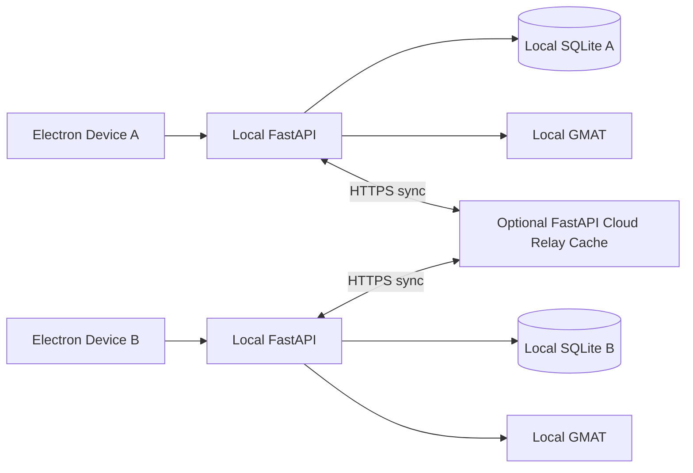

# Mission Dashboard

本地優先的軌道任務管理、General Mission Analysis Tool（GMAT）驗證與研究資料同步系統。每台 Electron 裝置使用自己的 FastAPI + SQLite；FastAPI Cloud 只作為可選、可重建的同步 Relay Cache（中繼快取），不再把 Neon PostgreSQL 當作正式資料來源。

## 架構



核心原則：

1. 所有寫入先提交到目前裝置的 SQLite，離線仍能工作。
2. 每 60 秒或由 Settings 的 `Sync Now` 主動同步。
3. 同步資料只有 Scenario 與 GMAT 正式驗證通過的 Solution。
4. `pending`、`failed`、系統錯誤及 Worker heartbeat 只留在產生它的裝置。
5. 同步紀錄包含版本時間與 SHA-256 內容雜湊，可去重、續傳及檢查毀損。
6. Relay Cache 遺失時，任何完整本地節點都能重新上傳，因此 Cloud 不是備份。

## 一致性邊界

這是低併發的 Eventually Consistent（最終一致）研究資料系統，不是多人即時共同編輯系統。同一個 Scenario 同一時間只應由一台裝置修改；Solution 使用全域隨機 ID，通過後視為不可變資料，只允許同步封存狀態。

若完全沒有持久化雲端儲存，兩台從未同時／先後接觸到同一個 Relay Cache 的裝置，無法憑空取得彼此資料。因此正式運作至少要有一台常駐 Seed Node（種子節點）定期同步；Cloud 快取被重建後由 Seed Node 回填。

## 本地資料

Electron 啟動時會一併啟動打包的 FastAPI sidecar，並把資料放在 Electron `userData/data/main.db`。SQLite 已啟用：

- Write-Ahead Logging（WAL，預寫式日誌）
- Foreign Key（外鍵）檢查
- 5 秒 busy timeout

本地手動開發：

```bash
cd backend
.venv/bin/python -m uvicorn app.main:app --host 127.0.0.1 --port 8000
.venv/bin/python -m pytest -q
```

```bash
cd frontend
npm install
npm run electron:dev
npm run lint
npm run test:electron
npm run build
```

## Relay Cache 部署

FastAPI Cloud 的 Relay 角色不使用 `DATABASE_URL`；即使 Neon integration 暫時仍保留由平台管理的環境變數，程式也會明確忽略它並使用 `/tmp/mission-dashboard-relay.db`。部署時設定 Relay 角色與組內共享同步金鑰：

```bash
cd backend
.venv/bin/fastapi cloud env set MISSION_DASHBOARD_NODE_ROLE relay
.venv/bin/fastapi cloud env set MISSION_DASHBOARD_SYNC_KEY '<long-random-team-key>'
.venv/bin/fastapi deploy .
```

部署後：

```bash
curl https://missiondashboard.fastapicloud.dev/health
curl -H 'X-Sync-Key: <long-random-team-key>' \
  https://missiondashboard.fastapicloud.dev/api/sync/manifest
```

`/health` 應顯示 `database: "sqlite"`、`nodeRole: "relay"`、`cloudBackend: "relay-cache"`。在每台 Electron 的 Settings 填入 Relay 地址與相同同步金鑰即可。

FastAPI Cloud 會自動更換執行個體，因此它的本機 SQLite 只能視為可丟失快取。若未來要保證所有裝置即使長期錯開上線仍能同步，應將 Relay 指向一台常駐 Seed Node，或新增小型持久化物件儲存；不能只依賴 Cloud 執行個體的本機檔案。

目前為組內 pre-auth 系統。Relay 同步端點必須設定 `MISSION_DASHBOARD_SYNC_KEY`；若要開放給非受信任使用者，還需要裝置身份、金鑰輪替、角色授權與稽核紀錄。

## 資料與機器學習邊界

Mission Dashboard 保存可重現的 Scenario、Decision Variables、單位／座標系、GMAT 結果和版本資訊。Machine Learning（ML，機器學習）專案再從這些紀錄產生 Supervised Learning（監督式學習）或 Reinforcement Learning（強化學習）資料。

明顯錯誤或隨機失敗不進入共享 Dataset。日後若需要 Feasibility Model（可行性模型），再從成功解附近產生少量 Hard Negative（困難負樣本）。

## 發布

### App 內更新

從 `v0.2.0` 開始，安裝版會在啟動後檢查 GitHub Releases，也可在 Settings → App Updates 手動檢查。發現新版時先詢問是否下載；下載完成後再詢問是否重新啟動安裝，不會強制中斷正在執行的 GMAT 工作。

已安裝的 `v0.1.0` 沒有 updater，因此必須最後一次手動安裝 `v0.2.0`；之後才可直接在 App 內更新。

Windows workflow 會把 NSIS 安裝器、`latest.yml` 與 blockmap 一起放進 GitHub Release。macOS 自動更新必須使用 Developer ID 正式簽章；目前的 ad-hoc 簽章只能產生手動安裝包，取得 Apple Developer 憑證並 notarize 前不能宣稱 macOS 自動更新已可用。

macOS：

```bash
cd frontend
npm run electron:build:mac
```

腳本會先以 PyInstaller 建立本地 FastAPI sidecar，再包進 Electron。Windows GitHub Actions 也會先建置對應的 `.exe` sidecar，之後產生 NSIS 安裝器。

詳細 GMAT 契約見 [backend/docs/gmat-validation-api-contract.md](backend/docs/gmat-validation-api-contract.md)，同步契約見 [backend/docs/local-first-sync.md](backend/docs/local-first-sync.md)。
