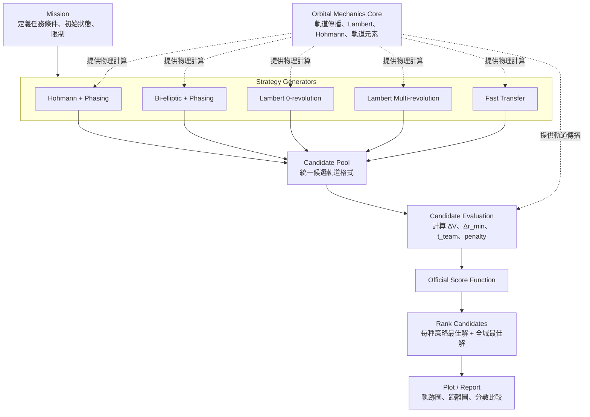

# Orbit Chaser：多策略軌道轉移最佳化系統

本專案用於 TASA 軌道追蹤競賽，目標是設計一套可以產生、評估並比較不同軌道轉移策略的系統。

核心想法是：

> 不先假設某一種軌道轉移方法一定最好，而是讓不同策略各自產生候選軌道，最後用官方評分函數比較。

---

## 任務目標

我們需要控制一顆衛星追蹤地球附近的目標物體。

競賽目標主要由三個因素決定：

1. 最小接近距離  
2. 任務完成時間  
3. 總速度增量，也就是燃料消耗  

因此我們的問題不是單純求最省燃料，也不是單純求最快，而是要在三者之間找到最高分的平衡點。

---

## 任務階段

### Phase 1：圓軌道目標

Phase 1 中，目標物體沿圓軌道運動。

因為圓軌道具有週期性，所以即使第一次沒有成功接近，後續仍然可以等待下一次相位機會。

這一階段可以利用：

- Hohmann Transfer
- Phasing Maneuver
- Lambert Transfer
- Multi-revolution Lambert Transfer
- Fast Transfer

Phase 1 的核心是：

> 用時間換燃料，或用燃料換時間，找出最高分的追蹤方案。

---

### Phase 2：雙曲線目標

Phase 2 中，目標物體沿雙曲線軌道逃逸。

因為雙曲線軌道沒有週期性，目標不會回到相同位置，所以我們只有一次主要攔截機會。

這一階段的核心方法會偏向：

- Lambert Transfer
- Fast Transfer
- One-shot Intercept
- Hyperbolic trajectory prediction

Phase 2 的核心是：

> 在有限時間窗口內找到一次性攔截機會。

---

## 系統架構



---

## 模組分工

整個系統分成四個主要部分：

```text
1. Mission
2. Orbital Mechanics Core
3. Optimizer / Strategy
4. Plot / Report
```

---

## 1. Mission

Mission 模組負責定義題目。

它包含：

- 地球重力參數
- 地球半徑
- 衛星初始狀態
- 目標初始狀態
- 目標軌道類型
- 任務階段
- 搜尋時間範圍
- 速度增量限制
- 懲罰條件

Phase 1 和 Phase 2 的主要差異會放在 Mission 裡。

```text
Phase 1:
    target = circular orbit
    可以等待週期性相位機會

Phase 2:
    target = hyperbolic trajectory
    只能做一次性攔截
```

---

## 2. Orbital Mechanics Core

Orbital Mechanics Core 是底層物理計算模組。

它不是單獨的策略，而是所有策略都會呼叫的工具庫。

它負責：

- 軌道傳播
- Hohmann Transfer 計算
- Bi-elliptic Transfer 計算
- Lambert Transfer 計算
- 軌道分類
- 軌道元素轉換
- 近地點、遠地點、週期計算
- 速度增量計算

這個模組只處理物理問題，不負責評分，也不負責決定哪個方案最好。

---

## 3. Optimizer / Strategy

Optimizer 的核心任務是：

> 讓不同軌道轉移策略產生候選解，然後統一比較。

目前規劃的策略包括：

| Strategy | 目的 |
|---|---|
| Hohmann + Phasing | 低燃料 baseline，適合 Phase 1 圓軌道目標 |
| Bi-elliptic + Phasing | 三脈衝轉移，可能在大半徑差時更省燃料 |
| Lambert 0-revolution | 直接點對點攔截 |
| Lambert Multi-revolution | Phase 1 中利用多圈轉移換取較低 ΔV |
| Fast Transfer | 用較高 ΔV 換取較短時間 |

每一種 Strategy 都會輸出候選軌道，最後進入同一個 Candidate Pool。

---

## Strategy 思路

### Hohmann + Phasing

Hohmann Transfer 通常是圓軌道到圓軌道的低燃料方案。

但 Hohmann 的轉移時間固定，因此需要等待正確相位。

適合：

```text
目標是圓軌道
任務允許等待
分數偏好低 ΔV
```

---

### Bi-elliptic + Phasing

Bi-elliptic Transfer 是三脈衝轉移。

它會先把衛星送到較高的中間遠地點，再轉移到目標軌道。

適合：

```text
初始軌道與目標軌道半徑差很大
任務允許較長時間
希望降低 ΔV
```

---

### Lambert 0-revolution

Lambert Transfer 解的是：

```text
給定出發位置、抵達位置、飛行時間
求所需轉移軌道
```

這是最通用的攔截方法。

適合：

```text
指定抵達時間
需要直接攔截
Phase 1 和 Phase 2 都可用
```

---

### Lambert Multi-revolution

Phase 1 的目標有週期性，因此可以讓衛星繞行多圈後再接近目標。

這可能增加任務時間，但降低速度增量。

適合：

```text
Phase 1
目標週期性返回
願意用時間換燃料
```

---

### Fast Transfer

Fast Transfer 不追求最低 ΔV，而是用更多燃料換更短時間。

適合：

```text
時間分數很重要
需要快速接近目標
允許較高 ΔV
```

---

## Candidate Evaluation

每個候選軌道都需要計算：

```text
1. 總速度增量 ΔV_team
2. 最小接近距離 Δr_min
3. 任務完成時間 t_team
4. 懲罰項 P_n
5. 官方分數 Score
```

Evaluation 階段會呼叫 Orbital Mechanics Core 進行軌道傳播，確認候選軌道是否真的接近目標。

---

## 官方評分函數

$$\text{Score} = 50 \exp\left(-\frac{\Delta r_{\min} - 5}{100}\right) + \frac{25}{1 + \exp(k_t(t_{\text{team}} - C_t))} + \frac{25}{1 + \exp(k_v(\Delta V_{\text{team}} - C_v))} - \sum P_n$$

其中：

```text
Δr_min      最小接近距離
t_team      任務完成時間
ΔV_team     總速度增量
P_n         懲罰項
```

我們會用這個分數來比較所有策略。

---

## 排名邏輯

所有候選軌道都用同一個官方分數比較。

```text
score 越高越好
```

如果分數相同，依照以下順序比較：

```text
1. Δr_min 較小者
2. ΔV_team 較小者
3. t_team 較短者
```

---

## MATLAB 專案規劃

```text
orbit-chaser/
│
├── main_phase1.m
├── main_phase2.m
│
├── mission/
│   ├── create_phase1_mission.m
│   └── create_phase2_mission.m
│
├── astro/
│   ├── circular_state.m
│   ├── propagate_universal.m
│   ├── solve_lambert.m
│   ├── hohmann_transfer.m
│   ├── bielliptic_transfer.m
│   ├── classify_orbit_from_state.m
│   └── state_to_elements.m
│
├── strategy/
│   ├── generate_all_strategies.m
│   ├── generate_hohmann_phasing_candidates.m
│   ├── generate_bielliptic_candidates.m
│   ├── generate_lambert_candidates.m
│   └── generate_fast_transfer_candidates.m
│
├── optimizer/
│   ├── evaluate_candidate.m
│   ├── rank_candidates.m
│   └── refine_candidate.m
│
└── plot/
    ├── plot_trajectory.m
    ├── plot_relative_distance.m
    └── plot_strategy_comparison.m
```

---

## 目前開發重點

目前先專注在整體 Strategy 架構。

優先順序：

```text
1. 定義 Mission
2. 定義 Candidate 格式
3. 建立 Strategy Generator 架構
4. 先完成 Lambert 0-rev
5. 加入 Hohmann + Phasing
6. 加入 Bi-elliptic
7. 加入 Strategy Comparison
8. 再處理 refinement
```

---

## 核心結論

本系統的解題方式是：

```text
Mission 定義題目
    ↓
多種 Strategy 產生候選軌道
    ↓
Orbital Mechanics Core 提供物理計算
    ↓
Evaluation 計算 ΔV、距離、時間
    ↓
官方 Score 評分
    ↓
選出每種 Strategy 的最佳解
    ↓
再選出 Global Best
```

最重要的設計原則：

> 不押注單一轉移方法，而是讓多種策略競爭，最後由官方評分函數決定最佳方案。
