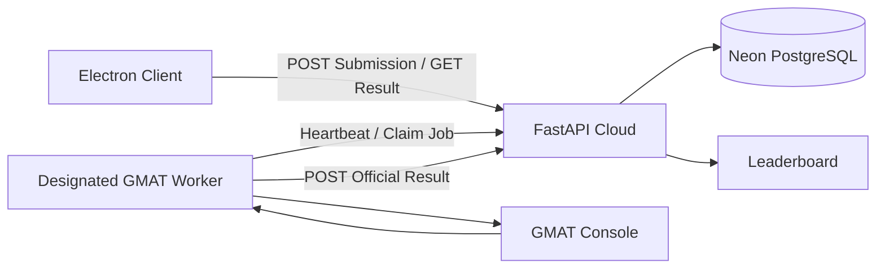

# Mission Dashboard

軌道競賽的 Electron + React Client、FastAPI Cloud 正式後端與本機 General Mission Analysis Tool（GMAT）驗證系統。FastAPI Cloud 是唯一公開 Application Programming Interface（API），Neon PostgreSQL 是唯一正式資料來源；本機電腦不需要公開網域或連入 Port。

## 架構



正式資料流：

1. Electron 使用本機 GMAT 做提交前物理驗證。
2. FastAPI Cloud 在 Neon 的同一個 transaction 保存 `Solution` 與 `Submission`。
3. 指定的本機 GMAT Worker 主動向 Cloud 領取任務，因此不需要 ngrok、Cloudflare、Port Forwarding 或 `CENTRAL_SERVER_URL`。
4. Worker 執行 GMAT propagation 後，以 claim token 回傳結果。
5. FastAPI Cloud 計分；Leaderboard 只查詢 `passed` Submission。

後端的正式實體為 `Scenario`、`Solution`、`Submission` 與 `ValidationWorker`。Queue 使用資料庫 row lock、180 秒 lease 與 claim token；Worker 中斷後，逾時任務可重新被領取，舊 Worker 不能覆寫新結果。

## 部署狀態

| 區域 | 實作 | 正式設定 |
|---|---|---|
| Electron Client | React、手動輸入、本機 GMAT 預驗證、結果輪詢 | 預設連線至 FastAPI Cloud |
| FastAPI Cloud | Scenario、Submission Queue、結果、計分、Leaderboard | <https://missiondashboard.fastapicloud.dev> |
| Neon PostgreSQL | 所有正式持久化資料 | 需在 Cloud 設定 `DATABASE_URL` |
| GMAT Worker | heartbeat、claim、GMAT、result | 在 Settings 勾選 `Run official validation worker` |

介面把啟用 Worker 的電腦稱為 **Official Validator（官方驗證電腦）**。
組內任一台 Electron 裝置都能在 Settings 啟用 Worker；正式賽事仍應只在
GMAT 版本與驗證環境一致的受控電腦啟用。

`chowseegun.app` 目前不參與系統運作；日後若只想換成較好看的 API 網址，再另外綁定即可。

## 檔案結構

```text
frontend/  React、Vite、Electron、本機 GMAT 與官方 GMAT Worker
backend/   FastAPI、SQLAlchemy、Neon/SQLite development adapter、測試與 Scenario
```

`backend/cloud_relay/` 只保留舊命令相容入口，實際 Cloud 與本機開發都使用同一個 `app.main:app`，不再維護第二套 relay 邏輯。

## 必要環境變數

FastAPI Cloud：

```text
DATABASE_URL=postgresql://...neon.tech/...?...sslmode=require
```

`DATABASE_URL` 必須使用 Neon 的 pooled connection string。Electron Client 不得持有此值，也不能直接連 PostgreSQL。

## 開發與驗證

Backend 可用 SQLite 做本機開發，但 SQLite 不是正式資料來源：

```bash
cd backend
.venv/bin/python -m uvicorn app.main:app --host 127.0.0.1 --port 8000
.venv/bin/python -m pytest -q
```

Frontend：

```bash
cd frontend
npm install
npm run electron:dev
npm run lint
npm run build
```

Electron 不再詢問 Server／Client Mode。要協助處理 Queue 時，在 Settings 設定 GMAT 路徑、勾選 `Run official validation worker` 後儲存：

```bash
cd frontend
MISSION_DASHBOARD_API_BASE_URL='https://missiondashboard.fastapicloud.dev/api' \
npm run electron:dev
```

macOS 也可用下列 helper 啟動，再到 Settings 開啟 Worker：

```bash
frontend/scripts/run_gmat_worker_macos.sh --dev
# 安裝正式 App 後：
frontend/scripts/run_gmat_worker_macos.sh
```

## FastAPI Cloud + Neon 上線

先在 Neon 建立 project/database，複製 pooled connection string，再設定 Cloud：

```bash
cd backend
.venv/bin/fastapi cloud env set DATABASE_URL 'postgresql://...'
.venv/bin/fastapi deploy .
```

部署後依序驗證：

```bash
curl https://missiondashboard.fastapicloud.dev/health
curl https://missiondashboard.fastapicloud.dev/api/scenarios
```

`/health` 應顯示 `database: "neon"`。指定 Worker 啟動後，`validationWorker` 應由 `offline` 變成 `ready`，且 `physicalValidation` 為 `true`。

目前是組內 pre-auth 部署：Worker 與管理端點沒有共享 token。若服務要開放給非受信任使用者，必須先補登入、角色授權與稽核紀錄，不能直接沿用此信任模型。

Scenario 與 Solution 使用 soft delete；一般列表與排行榜預設隱藏 archived 資料，但資料仍保留。Settings 可查看／恢復 archived 資料，並可把包含 active 與 archived 紀錄的資料集匯出成 JSON Lines（JSONL）或 Comma-Separated Values（CSV）。

2026-07-22 的正式端到端驗證已確認兩個方向：參考解經本機 GMAT
propagation 後為 `passed`，錯誤案例 `ΔV=[1,0,0]`、`finalCoastTime=100`
為 `failed`；Cloud 不會僅依照 Client JSON 判定成功。

詳細契約見 [backend/docs/gmat-validation-api-contract.md](backend/docs/gmat-validation-api-contract.md)。

## macOS 發布

```bash
cd frontend
npm install
npm run electron:build:mac
```

App 不再捆綁 FastAPI/SQLite sidecar，因此安裝包只包含 UI、Electron 與 GMAT 執行整合。輸出為 `frontend/dist/Mission-Dashboard-<version>-arm64.dmg`；目前為 ad-hoc signing，尚未 notarize。

Windows x64 版本由 GitHub Actions 的 Windows Runner 原生建置：

```text
Mission-Dashboard-<version>-windows-x64.exe
```

Windows 版會辨識 GMAT 安裝目錄內的 `bin/GmatConsole.exe`。目前安裝器尚未購買程式碼簽章憑證，因此 Windows SmartScreen 可能在第一次啟動時顯示「未知的發行者」；請只從本專案 GitHub Release 下載並核對同名 `.sha256.txt`。
