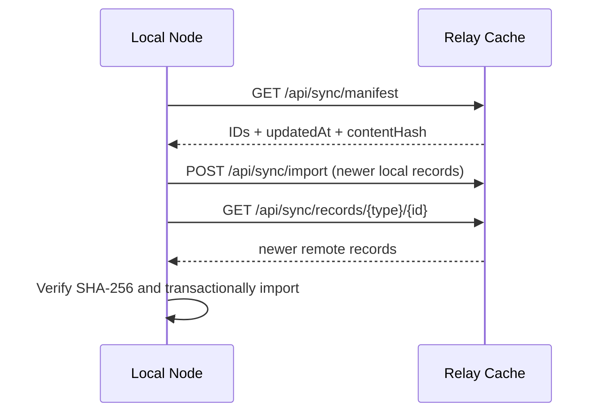

# Local-first Data Synchronization

## Purpose

讓多台 Mission Dashboard 裝置各自保存完整 SQLite 研究資料副本，網路恢復後再透過可選 Relay Cache 交換 Scenario 與已通過的 Solution。Relay 不是真實來源，也不是備份。

## Synchronized records

| Record | Included | Reason |
|---|---:|---|
| Scenario | Yes | 重現初始狀態、座標系、限制與評分 |
| Passed Solution + Submission | Yes | 可直接形成監督式學習資料 |
| Pending Submission | No | 只屬於本地工作佇列 |
| Failed Submission | No | 避免大量低價值隨機錯誤進入共享資料 |
| Worker heartbeat / claim | No | 短期操作狀態，不是研究資料 |

## Protocol

每次交換最多上傳 100 筆；Import 為 idempotent（冪等）。版本比較鍵為 `(updatedAt, contentHash)`，讓所有節點在同一組紀錄下得到確定結果。由於不同電腦可能有時鐘偏差，同一 Scenario 不應在多台裝置同時修改。

## API

- `GET /api/sync/manifest`
- `GET /api/sync/records/{scenario|solution}/{id}`
- `POST /api/sync/import`
- `GET /api/sync/settings`（只允許 Local 角色）
- `PUT /api/sync/settings`（只允許 Local 角色）
- `POST /api/sync/run`（只允許 Local 角色）

Relay 角色的交換端點使用 `X-Sync-Key`，其值必須等於環境變數 `MISSION_DASHBOARD_SYNC_KEY`。Relay 若未設定金鑰會回傳 HTTP 503。

## Recovery

1. 選擇一台已確認資料完整的 Seed Node。
2. 備份該節點的 `main.db`，並保留 SQLite WAL 檔案的一致性快照或使用 SQLite backup API。
3. 重新部署／清空 Relay Cache。
4. 在 Seed Node 執行 `Sync Now`，把完整 manifest 與缺少紀錄重新送至 Relay。
5. 其他裝置依序執行同步並比對 record count 與 content hash。

## Current limitations

- Relay Cache 本身不保證持久化。
- 尚未支援大型二進位檔或完整 trajectory；目前同步的是 JSON 型 Scenario 與決策結果。
- 尚未建立 Scenario 多主衝突編輯介面。
- Shared key 是組內第一版保護，不等同完整使用者身份與權限系統。
