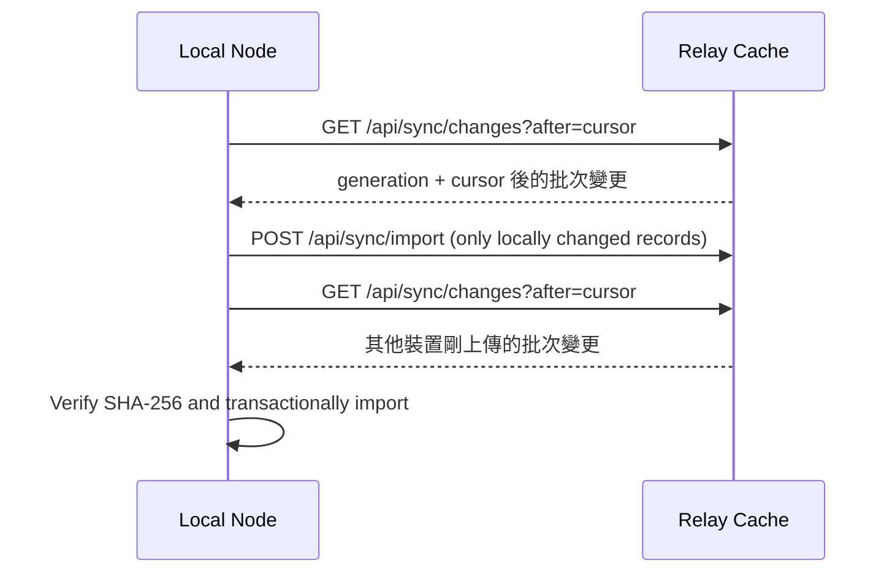

# Local-first Data Synchronization

## Purpose

讓多台 Mission Dashboard 裝置各自保存完整 SQLite 研究資料副本，網路恢復後再透過可選 Relay Cache 交換 Scenario 與已通過的 Solution。Relay 不是真實來源，也不是備份。

## Synchronized records

| Record | Included | Reason |
|---|---:|---|
| Scenario | Yes | 重現初始狀態、座標系、限制與評分 |
| Passed Solution + Submission | Yes | 可直接形成監督式學習資料 |
| Pending Submission | No | 單次本機驗證流程不再建立 pending queue |
| Failed Submission | No | 避免大量低價值隨機錯誤進入共享資料 |

## Protocol

每次最多上傳 100 筆、拉取 500 筆；Import 為 idempotent（冪等）。平常只交換上次成功同步後的變更。Relay 重建時 generation 改變，裝置才完整回填。由於不同電腦可能有時鐘偏差，同一 Scenario 不應在多台裝置同時修改。

## API

- `GET /api/sync/changes?after={cursor}&limit={1..500}`（主要增量介面）
- `POST /api/sync/import`
- `GET /api/sync/manifest` 與 `/records/{type}/{id}`（舊版 App 相容介面）
- `GET /api/sync/settings`（只允許 Local 角色）
- `PUT /api/sync/settings`（只允許 Local 角色）
- `POST /api/sync/run`（只允許 Local 角色）

Relay 交換端點不要求 Shared Key；每台裝置只要設定相同 Relay 地址並啟用同步即可交換資料。這個 pre-auth 模式只適合目前的非敏感團隊研究資料，不應直接用於公開競賽或敏感資料。

## Recovery

1. 選擇一台已確認資料完整的 Seed Node。
2. 備份該節點的 `main.db`，並保留 SQLite WAL 檔案的一致性快照或使用 SQLite backup API。
3. 重新部署／清空 Relay Cache。
4. 在 Seed Node 執行 `Sync Now`；它偵測到新 generation 後會完整回填 Relay。
5. 其他裝置依序執行增量同步並比對 record count 與 content hash。

## Current limitations

- Relay Cache 本身不保證持久化。
- 尚未支援大型二進位檔或完整 trajectory；目前同步的是 JSON 型 Scenario 與決策結果。
- 尚未建立 Scenario 多主衝突編輯介面。
- 目前依照團隊決策不使用 Shared Key，只適用於非敏感研究資料。
